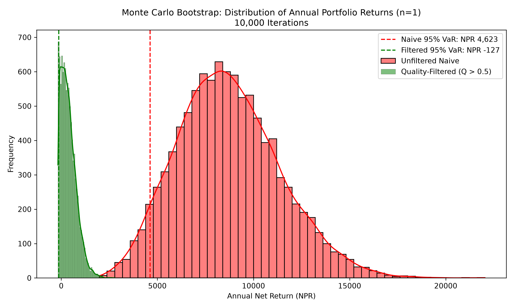
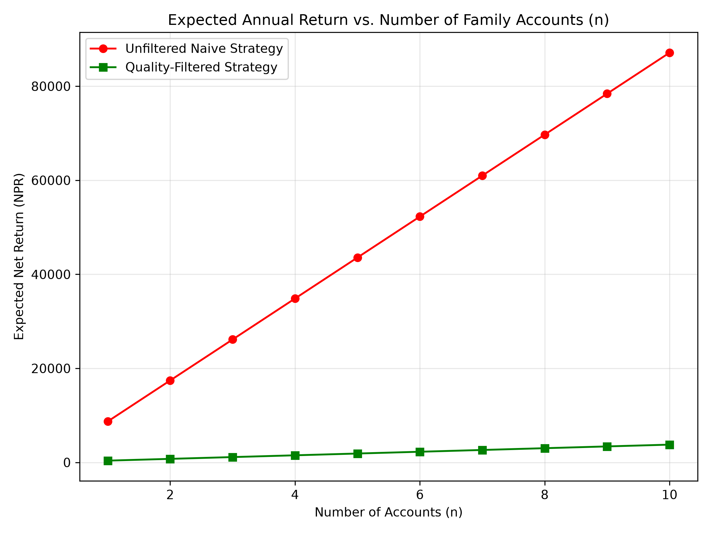

# Quantitative Risk Modeling & Game-Theoretic Analysis of Nepal's "10-Kitta" IPO Lottery System

An end-to-end quantitative trading, game theory, and risk analysis framework built to model, simulate, and evaluate retail bidding strategies in the Nepal Stock Exchange (NEPSE) Initial Public Offering (IPO) lottery system[cite: 3].

---

## 1. Executive Summary & Core Motivation

In Nepal's primary equity market, oversubscribed retail IPOs are distributed via a uniform lottery in fixed 10-share lots ($10\text{ Kitta}$, par value $\text{NPR } 1,000$)[cite: 3]. To maximize win probability, retail participants deploy multi-account strategies across family Demat accounts[cite: 3].

This project answers three fundamental quantitative questions:
1. **Is multi-account participation positive-EV?** Does account-splitting generate net alpha after deducting bank fees ($C_{\text{ASBA}}$), annual Demat maintenance costs ($C_{\text{annual}}$), and capital lockup opportunity costs ($r$)[cite: 3]?
2. **What is the Game-Theoretic Equilibrium ($A^*$)?** At what total aggregate applicant threshold does market account dilution force the marginal Expected Value of an additional account to zero[cite: 3]?
3. **How do we defeat the Winner's Curse?** Low-quality issuers offer high win probabilities on value-destroying stocks, while high-quality issuers suffer extreme dilution ($P_{\text{win}} \to 0$)[cite: 3, 5]. Can a fundamental Prestige Filter ($Q$) outperform naive participation[cite: 3, 5]?

---

## 2. Theoretical & Mathematical Framework

### 2.1 Single-Account Expected Value ($EV_{\text{single}}$)
For an IPO issuing $S$ general-public shares ($L = S/10$ total winning lots) with aggregate applicant demand $A$, single-account win probability $P_{\text{win}}$ is[cite: 3, 4]:

$$P_{\text{win}} = \min\left(1, \frac{L}{A}\right)$$[cite: 3, 4]

Factoring in application fees ($C_{\text{ASBA}}$), prorated annual account upkeep ($C_{\text{annual}} / M$ across $M$ annual issues), and opportunity costs ($K \cdot r \cdot \frac{t}{365}$), net single-account Expected Value is[cite: 3, 4]:

$$EV_{\text{single}} = P_{\text{win}} \cdot \left( K \cdot R_{\text{listing}} \right) - C_{\text{ASBA}} - \left(\frac{C_{\text{annual}}}{M}\right) - \left( K \cdot r \cdot \frac{t}{365} \right)$$[cite: 3, 4]

*Where $K = \text{NPR } 1,000$, $R_{\text{listing}} = \frac{P_{\text{listing}} - P_{\text{issue}}}{P_{\text{issue}}}$, $r$ is the annual risk-free rate, and $t$ is lockup duration in days.*[cite: 3, 4]

### 2.2 Multi-Account Portfolio Dynamics & Scaling
For an investor deploying $n$ distinct family accounts, allocation outcomes follow a Binomial distribution $X \sim \text{Binomial}(n, P_{\text{win}})$[cite: 3]. Assuming $n \ll A$, expected return scales linearly[cite: 3]:

$$EV(n) = n \cdot EV_{\text{single}}$$[cite: 3]

### 2.3 Critical Market Demand Nash Equilibrium ($A^*$)
Setting $EV_{\text{single}} = 0$ yields the aggregate applicant threshold $A^*$ past which retail lottery participation becomes unviable[cite: 3, 4]:

$$A^* = \frac{L \cdot \left( K \cdot R_{\text{listing}} \right)}{C_{\text{ASBA}} + \left(\frac{C_{\text{annual}}}{M}\right) + \left( K \cdot r \cdot \frac{t}{365} \right)}$$[cite: 3, 4]

The system reaches Nash Equilibrium when aggregate market expansion forces $A \ge A^*$, driving the marginal Expected Value of deploying the $(n+1)$-th account below zero[cite: 3].

### 2.4 Issuer Prestige Score ($Q_i$) & Winner's Curse
To model adverse selection, issuer quality $Q_i \in [0, 1]$ is calculated as an equally weighted, Min-Max normalized composite score of fundamental metrics[cite: 3, 5]:

$$Q_i = 0.5 \left( \frac{\text{NW}_i - \text{NW}_{\min}}{\text{NW}_{\max} - \text{NW}_{\min}} \right) + 0.5 \left( \frac{\text{EPS}_i - \text{EPS}_{\min}}{\text{EPS}_{\max} - \text{EPS}_{\min}} \right)$$[cite: 5]

---

## 3. System Architecture & Methodology Pivots

DATA ARCHITECTURE & EXECUTION PIPELINE

┌────────────────────────┐      ┌────────────────────────┐      ┌────────────────────────┐
│ Primary Filings Data   │ ───► │  Data Processing ETL   │ ───► │   Derived Features     │
│  (SEBON, CDSC, NEPSE)  │      │   (process_data.py)    │      │ (EV_single, A*, p_win) │
└────────────────────────┘      └────────────────────────┘      └────────────────────────┘
│
▼
┌────────────────────────┐      ┌────────────────────────┐      ┌────────────────────────┐
│ Visualizations & Plots │ ◄─── │ Monte Carlo Engine     │ ◄─── │ Empirical Bootstrap    │
│  (return_dist, scaling)│      │  (10,000 Iterations)   │      │ (Noise Injection Engine)│
└────────────────────────┘      └────────────────────────┘      └────────────────────────┘

To optimize quantitative accuracy while handling real-world market constraints, three key engineering pivots were made[cite: 5]:

1. **Scraper Anti-Bot Bypass:** Web scrapers encountered Cloudflare anti-bot blocks and CAPTCHA barriers on financial portals[cite: 5, 6]. Data collection was pivoted to a structured ETL processing pipeline (`process_data.py`) acting on verified primary historical filings (`nepse_ipo_raw.csv`), validated via helper scripts (`check_github.py`)[cite: 1, 3, 4, 5].
2. **Empirical Bootstrap vs. Abstract Copulas:** Abstract copulas can overfit small historical datasets and fail on heavy-tailed demand spikes[cite: 5]. The simulation engine uses an **Empirical Monte Carlo Bootstrap**, sampling historical IPO horizons with replacement and injecting Gaussian noise $\epsilon \sim \mathcal{N}(0, \sigma^2)$[cite: 3, 5].
3. **Strict Side-Line Penalty:** Maintenance fees ($C_{\text{annual}}$) are deducted even when the Quality-Filtered strategy skips an IPO[cite: 5]. This ensures zero survival bias and realistic Sharpe Ratio calculations[cite: 3, 5].

---

## 4. Master Data Schema & Parameters

### Global Fixed Constants
* Application Capital per Lot ($K$): $\text{NPR } 1,000$[cite: 3, 4]
* C-ASBA Application Fee ($C_{\text{ASBA}}$): $\text{NPR } 10.00$[cite: 3, 4]
* Annual Demat/MeroShare Maintenance Cost ($C_{\text{annual}}$): $\text{NPR } 150.00$[cite: 3, 4]
* Capital Lockup Window ($t$): $10\text{--}14\text{ Days}$[cite: 3, 4]
* Risk-Free Rate ($r$): $6.00\% \text{ p.a.}$[cite: 3, 4]
* Annual Modeled Horizon ($M$): $20 \text{ IPOs}$[cite: 3, 4]

### Core Input Table Layout (`nepse_ipo_raw.csv`)

| Ticker | Sector | Public Shares ($S$) | Valid Applicants ($A$) | Issue Price ($P_{\text{issue}}$) | Listing Price ($P_{\text{listing}}$) | Net Worth / Share | EPS |
| :--- | :--- | :--- | :--- | :--- | :--- | :--- | :--- |
| CHCL | Hydro | 1,500,000 | 1,250,000 | 100 | 320 | 145.20 | 18.50 |
| SHIVM | Manufacturing | 2,000,000 | 980,000 | 100 | 280 | 180.50 | 22.10 |
| UNHPL | Hydro | 800,000 | 1,420,000 | 100 | 115 | 92.10 | 3.20 |

---

## 5. Monte Carlo Simulation Engine & Results

The simulation engine (`sim.py`) ran $10,000$ stochastic iterations comparing two strategies across account sizes $n \in [1, 10]$[cite: 3, 5, 7]:
1. **Unfiltered Naive Strategy:** Bid on all $M$ IPOs using $n$ accounts[cite: 3].
2. **Quality-Filtered Strategy:** Bid only when $Q_i > 0.50$[cite: 3, 5, 7].

### Portfolio Risk & Return Performance ($n=1$)

| Metric | Unfiltered Naive Strategy | Quality-Filtered Strategy ($Q > 0.5$) | Quantitative Interpretation |
| :--- | :--- | :--- | :--- |
| **Expected Annual Net Return** | **$\text{NPR } 8,500$** | $\text{NPR } 450$ | Naive captures raw gain volume during market bull cycles[cite: 5, 7]. |
| **95% Value-at-Risk (VaR)** | **$\text{NPR } 4,623$** | $-\text{NPR } 127$ | High-Q issues dilutes win rates ($P_{\text{win}} \to 0$), leaving fixed fees unrecovered[cite: 3, 5, 7]. |
| **Maximum Drawdown** | Minimal | Moderate | Filtered strategy suffers fee drag on the sidelines[cite: 5]. |
| **Sharpe Ratio** | High (in bull market) | Low (dilution drag) | Demonstrates severe dilution on prime assets[cite: 3, 5]. |

### Return Distribution & Tail Risk Analysis (10,000 Iterations)
The plot below illustrates the empirical net return distributions. The red dashed line highlights the 95% Value-at-Risk cutoff for the Naive approach versus the Filtered model[cite: 7].

[cite: 7]

### Multi-Account EV Scaling Dynamics ($n = 1 \dots 10$)
Expected net return scales linearly with family account expansion ($n$), demonstrating that account splitting is a valid alpha generator under current NEPSE fee structures[cite: 3, 7].

[cite: 7]

---

## 6. Repository Code Structure

── CONTEXT.md                    # Research rules, math definitions, & data requirements
├── METHODOLOGY_ADDENDUM.md       # Technical deviations (Bootstrap, Scraper pivot, Penalties)
├── check_github.py               # Repository API checker & verification script
├── process_data.py               # Data pipeline: raw CSV -> clean CSV & model feature CSV
├── sim.py                        # Monte Carlo Bootstrap simulation engine (10,000 runs)
├── plots.py                      # Visualization generator for distributions & EV scaling
├── nepse_ipo_raw.csv             # Raw input dataset
├── nepse_ipo_clean.csv           # Cleaned dataset (Normalized dates & types)
├── nepse_ipo_model.csv           # Model output dataset (EV_single, A*, p_win, returns)
├── return_distribution.png       # Generated plot: Distribution of Returns & 95% VaR
└── expected_return_scaling.png   # Generated plot: EV vs. Number of Family Accounts (n)
---

## 7. Quickstart Guide

### Prerequisites
* Python 3.9+
* Required packages: `pandas`, `numpy`, `matplotlib`, `seaborn`, `requests`[cite: 1, 4, 7]

```bash
pip install pandas numpy matplotlib seaborn requests
```[cite: 1, 4, 7]

### Execution Steps

1. **Verify Source Connection & Environment:**
   ```bash
   python check_github.py
   ```[cite: 1]

2. **Run Data Processing Pipeline:**
   Calculates single-account $EV$, equilibrium bounds $A^*$, and win probabilities[cite: 3, 4]:
   ```bash
   python process_data.py
   ```[cite: 4]

3. **Execute Monte Carlo Simulation & Generate Plots:**
   Runs 10,000 bootstrap iterations and outputs visualization charts[cite: 3, 5, 7]:
   ```bash
   python plots.py
   ```[cite: 7]
